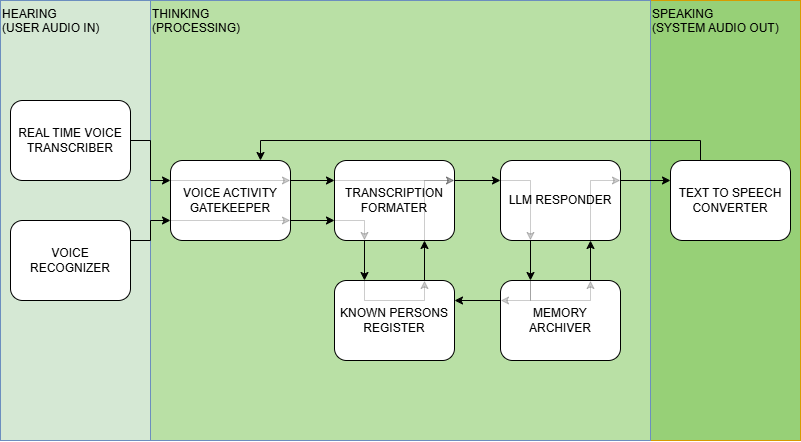
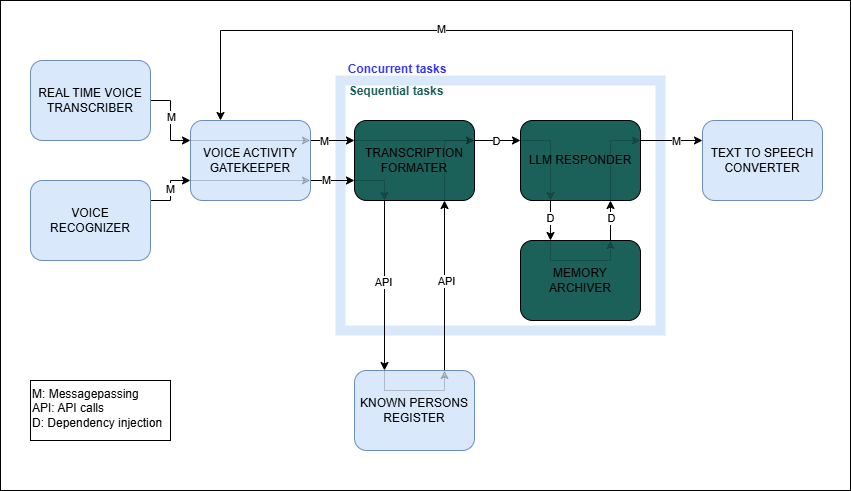

# System Architecture

## Overview

This document provides an overview of the system architecture for **VOICE**. The system functionality is divided into three main operations: **Hearing**, **thinking** and **speaking**. In addition to this the system will **hibernate** when it has spent some specified amount of time out of conversatinos. It will then need to be **awakened**.

## Components and data flow

**Hearing**
- **Real time voice transcriber**: Processes and recognizes voice data from system microphone. Outputs text.

- **Voice recognizer**: Analyzes voice data from system microphone and outputs voice properties.

**Thinking**
- **Voice activity gatekeeper**: Blocks audio transcripts information flow when system is generating a response or hybernating. Responsible for system **hibernation** and **awakening**.

- **Transcription formater**: Formats the transcription from voice for deliverance to the LLM responder. Uses the results from the voice recognizer to lookup names in the Known Persons Register.

- **Known persons register**: Holds a register of known persons and their corresponding voice recognition properties.

- **LLM responder**: Generates a response based on initial configuration values, the formated transcription and memories from the Memory Archive.

- **Memory archiver**: Archives new information the LLM finds important and retrieves previously stored information. Updates the Known Persons Register if person has been introduced.

**SPEAKING**
- **Text to speech converter**: Converts the output from the LLM Responder to speech audio file and plays it. Notifies the Voice Activity Gatekeeper when the system is done speaking and ready to get more user input.

## Interaction Diagram

## Communication

The **Real Time Voice Transcriber**, the **Voice Recognizer** will be running on seperate threads and communicate to the **Voice Activity Gatekeeper** through messagepassing. This is due to the plan to use Azure Voice Recognition and Voice Transcription APIs simultanously, and Azures Transcription SDK rund asynchronous and is hell to deal with in synchronous code.

The **Voice Activity Gatekeeper** will communicate to the **Transcription Formater** through messagepassing. This is again so that **Voice Activity Gatekeeper** can run asynchronous and have a fast response time to deal with more Azure bullshit. The **Transcription Formater**, **LLM Responder** and **Memory Archiver** will communicate through dependency injection. This is due to the simple fact that it is easier to deal with.

The **Text to Speech Converter** will run asynchronously on another thread and communicate through messages. This makes all communication to the **Voice Activation Gatekeeper** messaging, again to make it most responsive.

The **Transcription Formater** will communicate to the **Known Persons Register** through RESTApi calls. This is due to the fact that i am terrible with APIs and web communication and know as much about databases as a dry turd.

A figure containing the communication overview is shown in the figure below.

## Critique

System architect diagram has some loops. This suggest entanglement and circular dependencies in components. No current suggestions for fixes.